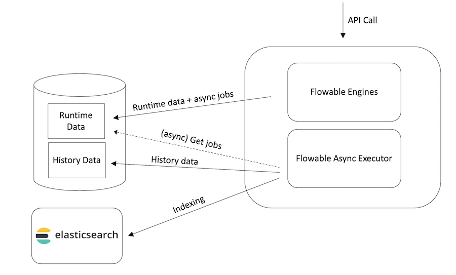

---
marp:true
---
<!-- theme: default -->
# <!-- fit --> Flowable Work Indexing

---
<!--
header: Flowable Work Indexing
paginate: true 
-->
---
<style>
section.centeredSection {
  text-align: center;
}

section.smallerFont {
  font-size: 24px;
}
</style>

- In Flowable Work, critical business data is continuously indexed as users are working with processes, cases, tasks, etc.
- Flowable Platform/Work expose API’s (in REST and Java) to query and work with the data efficiently.

---

## Architecture
<!--
_class: centeredSection
-->


---

## Indexed entities

- **work**: Contains the 'work instances'. A work instance is a root process or case instance.
- **case-instances**: Contains all case instances (runtime and historical).
- **process-instances**: Contains all process instances (runtime and historical).
- **tasks**: All tasks (process, case, or standalone) get indexed here.
- **users**: Users and user information gets indexed here.
- **plan-items**: Stores information about plan item instances of a case instance and this is useful for heat * maps or analyzing case instance optimizations.
- **activities**: Stores information about activities executed as part of process instance executions and this is useful for heat maps or analyzing process instance optimizations.

---

## Common indexed data

- Fields indicating instance information (e.g., the case instance id, name, etc...).
- Fields indicating the parent scope
- Fields indicating the parent scope definition
- Fields indicating the root scope
- Fields indicating the root scope definition
- Variables
- IdentityLinks.

---

## Example of indexed process

```json
{
  "id": "PRC-11efd3b7-b9e5-11e9-8272-723dcf61d880",
  "activityId": "endnoneevent1",
  "durationInMillis": 4998,
  "startUserId": "admin",
  "startActivityId": "startnoneevent1",
  "deploymentId": "PRC-c700c8cc-b9e4-11e9-8272-723dcf61d880",
  "candidateGroups": [],
  "tenantId": "",
  "startTime": "2019-08-08T14:01:51.109Z",
  "endTime": "2019-08-08T14:01:56.107Z",
  "involvedUsers": [
    "admin"
  ],
  "processDefinitionVersion": 1,
  "processDefinitionId": "PRC-aProcess:1:c70c1372-b9e4-11e9-8272-723dcf61d880",
  "processDefinitionKey": "aProcess",
  "processDefinitionName": "A Process",
  "variables": [ /*... variables data ... */ ],
  "__flowableVersion": 2,
  "identityLinks": [
    {
      "id": "IDL-11f1a879-b9e5-11e9-8272-723dcf61d880",
      "type": "starter",
      "userId": "admin"
    },
    // ... more identity links for the owner, the assignee, etc.
  ]
}
```

---

## Example of indexed task

```json
{
  "id": "TSK-11f66370-b9e5-11e9-8272-723dcf61d880",
  "name": "A Task",
  "executionId": "PRC-11f2b9ea-b9e5-11e9-8272-723dcf61d880",
  "owner": null,
  "assignee": "admin",
  "involvedUsers": [ "admin" ],
  "candidateGroups": [],
  "createTime": "2019-08-08T14:01:51.146Z",
  "endTime": "2019-08-08T14:01:56.077Z",
  "formKey": "aForm",
  "priority": 50,
  "taskDefinitionKey": "formtask1",
  "taskModelName": "A Task",
  "processInstanceId": "PRC-11efd3b7-b9e5-11e9-8272-723dcf61d880",
  "processInstanceName": null,
  "processDefinitionId": "PRC-aProcess:1:c70c1372-b9e4-11e9-8272-723dcf61d880",
  "processDefinitionKey": "aProcess",
  "processDefinitionName": "A Process",
  "scopeId": "PRC-11efd3b7-b9e5-11e9-8272-723dcf61d880",
  "scopeType": "bpmn",
  "scopeDefinitionName": "A Process",
  "scopeDefinitionId": "PRC-aProcess:1:c70c1372-b9e4-11e9-8272-723dcf61d880",
  "scopeDefinitionKey": "aProcess",
  "parentScopeId": "PRC-11efd3b7-b9e5-11e9-8272-723dcf61d880",
  "parentScopeType": "bpmn",
  "parentScopeDefinitionId": "PRC-aProcess:1:c70c1372-b9e4-11e9-8272-723dcf61d880",
  "parentScopeDefinitionKey": "aProcess",
  "parentScopeDefinitionName": "A Process",
  "rootScopeId": "PRC-11efd3b7-b9e5-11e9-8272-723dcf61d880",
  "rootScopeType": "bpmn",
  "rootScopeDefinitionId": "PRC-aProcess:1:c70c1372-b9e4-11e9-8272-723dcf61d880",
  "rootScopeDefinitionKey": "aProcess",
  "rootScopeDefinitionName": "A Process",
  "variables": [ /* ... Variables ... */  ],
  "identityLinks": [ /* identity links */  ],
  "extractedTextFromASubFormInUppercaseAsAField": "ASDASDASDASD", //<-- What is this field? 🤔
}
```

---

## Indexing Variables

Variables are indexed for:

- Work instances (/work)
- Case instances (/case-instances)
- Process instances (/process-instances)
- Tasks (/tasks)

Variables are stored as a nested JSON document.

---

## Variable Scoping - Scoping rules

- Each element stores its own variables. Forms store the variables at the process/case level.
- Explicit in/out mappings can be used to copy variables downstream and upstream.
- It is possible to reference variables in the root scope and in the parent scope ✱.
<!-- _footer: ✱ Not available in the Open Source distribution -->

---

## Variable Scoping - Scope information

- scopeId: The instance id where this variable was created.
- scopeType: BPMN or CMMN
- scopeHierarchyType: PARENT, ROOT, or TASK (for task-local variables).
- scopeDefinitionId: The definition id corresponding to the scope.
- scopeDefinitionKey: The definition key corresponding to the scope.

---

## Example of indexed variables

```json
{
  // ...Fields...
  "variables": [
    {
      "scopeId": "PRC-11efd3b7-b9e5-11e9-8272-723dcf61d880",
      "scopeDefinitionId": "PRC-aProcess:1:c70c1372-b9e4-11e9-8272-723dcf61d880",
      "scopeDefinitionKey": "aProcess",
      "textValue": "admin",
      "scopeType": "bpmn",
      "rawValue": "admin",
      "name": "initiator",
      "id": "VAR-11f048e8-b9e5-11e9-8272-723dcf61d880",
      "type": "string",
      "textValueKeyword": "admin"
    },
    {
      "scopeId": "PRC-11efd3b7-b9e5-11e9-8272-723dcf61d880",
      "scopeDefinitionId": "PRC-aProcess:1:c70c1372-b9e4-11e9-8272-723dcf61d880",
      "scopeDefinitionKey": "aProcess",
      "textValue": "asdasdasd",
      "scopeType": "bpmn",
      "rawValue": "asdasdasd",
      "name": "aText",
      "id": "VAR-14e4a9cb-b9e5-11e9-8272-723dcf61d880",
      "type": "string",
      "textValueKeyword": "asdasdasd"
    }
  ],
  // ...Fields...
}
```

---

## Variable propagation and update rules

- When a **new instance** (work/process/case/task) is created, the tree is traversed upwards to gather the parent and root variables.
- When a **new variable** gets set (e.g., in a service task), the tree is traversed downwards to propagate the variable to the child instances (work/process/case/task).
- **Updates to variables** are propagated through the whole tree for all instances that have visibility on these variables:
  - An update on a root variable is propagated to all nodes. 
  - An update in the middle of a tree is propagated to the direct child.

---

## Variable propagation fruits example

Each fruit item has a (fruit) variable and the corresponding root and parent (fruit)variables.

```text
- 🍎 case        [🍎(s)]
  - 🍐 case      [🍎(r),🍎(p),🍐(s)]
    - 🍋 process [🍎(r),      🍐(p),🍋(s)]
    - 🍌 process [🍎(r),      🍐(p),🍌(s)]
      - 🍓 task  [🍎(r),            🍌(p),🍓(s)]
      - 🍍 task  [🍎(r),            🍌(p),🍍(s)]
  - 🍊 case      [🍎(r),🍎(p),🍊(s)]
    - 🍇 process [🍎(r),      🍊(p),🍇(s)]
    - 🥝 task    [🍎(r),      🍊(p),🥝(s)]
```

(r) → root, (p) → parent, (s) → self

---
<!--
_class: centeredSection
-->


_Infinite levels are possible but three levels will make your life easier._

Case → Process → Task

🙌🏻

---

## Flowable REST API query endpoints

Flowable Work exposes some endpoints to consume the information stored in ES.

- **Work:** [/platform-api/search/query-work-instances](https://documentation.flowable.com/appdev-swagger/3.2.0/_attachments/platform.html#/Work%20instances/searchWorkInstancesWithQuery)
- **Cases:** [/platform-api/search/query-case-instances](https://documentation.flowable.com/appdev-swagger/3.2.0/_attachments/platform.html#/Case%20instances/customSearchCaseInstancesWithQuery)
- **Process:** [/platform-api/search/query-process-instances](https://documentation.flowable.com/appdev-swagger/3.2.0/_attachments/platform.html#/Process%20instances/searchProcessInstancesWithQuery)
- **Tasks:** [/platform-api/search/query-tasks](https://documentation.flowable.com/appdev-swagger/3.2.0/_attachments/platform.html#/Tasks/customSearchTasksWithQuery)

Example:

```url
http://localhost:8090/platform-api/search/query-tasks?completed=false&caseDefinitionName=Simple%20Case
```

---

## Flowable REST API query endpoints example response

```json
{
  "data" : [ {
    "id" : "TSK-e01ad48d-b944-11e9-9bb3-723dcf61d880",
    "assignee" : "admin",
    "name" : "A Task",
    "createTime" : "2019-08-07T20:55:08.023+02:00",
    // ... other fields ...
    "taskVariable" : "taskVariableValue",
    "root" : {
      "foo" : "fooValue",
      "form_aForm_outcome" : "COMPLETE",
      "initiator" : "admin"
    },
    "parent" : {
      "foo" : "fooValue",
      "form_aForm_outcome" : "COMPLETE",
      "initiator" : "admin"
    }
  } ],
  // ES result information fields
}
```

---

## Reindexing - When?

May be required when:

- There is a Flowable product upgrade that changes the structure of the data
- The index is corrupt due to a network / persistence **catastrophical** problem.

The first reason is rare. In any case, the release notes indicate if a reindexing process must be executed.
The second reason is even rarer. ES indices are not military grade resistant like DB indices but anyway, they are fairly consistent and stable.

---
## Reindexing algorithm
<!--
_class: smallerFont
-->

1. A new index is created with a unique name.
1. Data from the database tables are fetched in pages (multiple rows at once) and in parallel.
1. Each page is processed, and the data from the tables is transformed into a job for the Flowable async executor. This action too, is parallelized.
1. The async history executor now picks up the job and transforms the job into a bulk index request for Elasticsearch.
1. Once Elasticsearch acknowledges the indexation, the job is deleted. In case some parts of the bulk index failed, a new job with the failing parts is created to be picked up and retried later.
1. When all jobs have been processed, the alias is swapped to the index created in step 1.
1. A new reindexing is now planned to catch any data that has been added, updated, or removed since the reindexing was triggered. This has no impact on users, as it runs asynchronously in the background, and the index was already swapped in step 6.

---

## Reindexing endpoints

- **Work instances**: POST platform-api/work/reindex
- **Case instances**: POST platform-api/case-instances/reindex
- **Process instances**: POST platform-api/process-instances/reindex
- **Tasks**: POST platform-api/tasks/reindex
- **Activities**: POST platform-api/activities/reindex
- **Plan items**: platform-api/plan-items/reindex
- **Users**: POST idm-api/users/reindex

---

## Advanced topics

- Mapping extensions
  - Using Variable Values For Full-Text Search
  - Extracting Variable Values Into Custom Variable Fields
  - Extracting Values from JSON Variables
- Custom aliases
- Dynamic queries
- Custom sorting
- Paging queries
- Dynamic queries with Templates
- Low-Level Bulk Request Interceptor

---

## Practical exercise

We will build, step by step, a Flowable Work application with indexing customizations, custom aliases and dynamic queries. Also, we will create a Flowable Page that uses a dynamic query.

---
<!--
_class: centeredSection
-->
## Wrap-up, Q & A