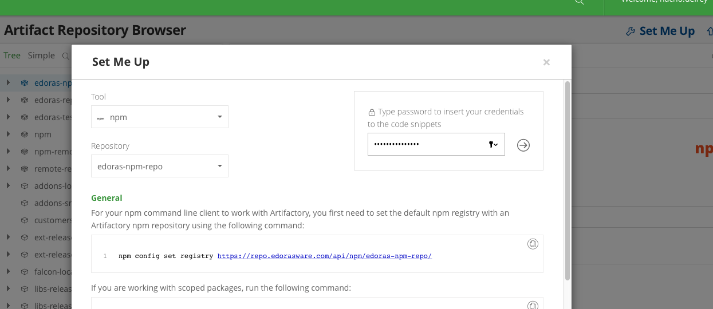

---
marp:true
title: Flowable Work Indexing
---

<!-- theme: default -->
<style>

section {
    background: #fff url(img/background.png) no-repeat center center;
  background-size: cover;
  font-family: "Montserrat";
}

section.centeredSection {
  text-align: center;
}

section.smallerFont {
  font-size: 24px;
}

@font-face {
  font-family: 'Montserrat';
  font-style: normal;
  font-weight: 200;
  src: local('Montserrat ExtraLight'), local('Montserrat-ExtraLight'),
       url('./fonts/montserrat-v12-latin-200.woff2') format('woff2'), /* Chrome 26+, Opera 23+, Firefox 39+ */
       url('./fonts/montserrat-v12-latin-200.woff') format('woff'); /* Chrome 6+, Firefox 3.6+, IE 9+, Safari 5.1+ */
}
/* montserrat-300 - latin */
@font-face {
  font-family: 'Montserrat';
  font-style: normal;
  font-weight: 300;
  src: local('Montserrat Light'), local('Montserrat-Light'),
       url('./fonts/montserrat-v12-latin-300.woff2') format('woff2'), /* Chrome 26+, Opera 23+, Firefox 39+ */
       url('./fonts/montserrat-v12-latin-300.woff') format('woff'); /* Chrome 6+, Firefox 3.6+, IE 9+, Safari 5.1+ */
}
/* montserrat-regular - latin */
@font-face {
  font-family: 'Montserrat';
  font-style: normal;
  font-weight: 400;
  src: local('Montserrat Regular'), local('Montserrat-Regular'),
       url('./fonts/montserrat-v12-latin-regular.woff2') format('woff2'), /* Chrome 26+, Opera 23+, Firefox 39+ */
       url('./fonts/montserrat-v12-latin-regular.woff') format('woff'); /* Chrome 6+, Firefox 3.6+, IE 9+, Safari 5.1+ */
}
/* montserrat-500 - latin */
@font-face {
  font-family: 'Montserrat';
  font-style: normal;
  font-weight: 500;
  src: local('Montserrat Medium'), local('Montserrat-Medium'),
       url('./fonts/montserrat-v12-latin-500.woff2') format('woff2'), /* Chrome 26+, Opera 23+, Firefox 39+ */
       url('./fonts/montserrat-v12-latin-500.woff') format('woff'); /* Chrome 6+, Firefox 3.6+, IE 9+, Safari 5.1+ */
}
/* montserrat-700 - latin */
@font-face {
  font-family: 'Montserrat';
  font-style: normal;
  font-weight: 700;
  src: local('Montserrat Bold'), local('Montserrat-Bold'),
       url('./fonts/montserrat-v12-latin-700.woff2') format('woff2'), /* Chrome 26+, Opera 23+, Firefox 39+ */
       url('./fonts/montserrat-v12-latin-700.woff') format('woff'); /* Chrome 6+, Firefox 3.6+, IE 9+, Safari 5.1+ */
}
</style>
# <!-- fit --> Creating a React application with Flowable Forms

---

# Flowable Forms introduction

- Flowable forms is Flowable's declarative forms library written in React.
- Everything you need to know is available in https://forms.flowable.io
- The online documentation lets you play with the library's components on-line with [Storybook](https://github.com/storybookjs/storybook).
- The library can be downloaded from the Flowable NPM repository
- The library is used by Flowable products like Flowable Work and Engage, in Flowable's customer solutions (projects) and also by other companies for their own projects.
- The Product team is constantly maintaining and enhancing the library. Specially, following the customer's feedback.


---
# <!-- fit --> We are building form engines for 10 years.

--- 


---


Yes, it hurts.

Don't do it at home.

Just... don't do it.

---

# Version history

|  alias  | Company | Technology | Timing | Status |
| --- | --- | --- | --- | --- |
| jsf engine | edorasware | JSF | ~2009 | Deprecated
| form engine | edorasware | Angular 1.3 | 2010 - 2016 | Deprecated |
| view engine | edorasware | Angular 1.5 | 2015 - now | Maintained |
| Flowable Forms | Flowable |  React 16.6 | 2018 - now | Active |

---

# Installation (1/2)

Configure ~/.npmrc

```bash
npm set registry https://repo.edorasware.com/api/npm/edoras-npm-repo
npm login
```

Go to https://repo.edorasware.com/ and complete a Set Me Up process. 
Choose Tool: NPM, Repository: libs-release-local-npm, and Insert your credentials



---

# Installation (2/2)

Copy the 3 lines from Basic Authentication section into your .npmrc file 


Check the configuration with npm info

```bash
npm info @flowable/forms
```

Finally, you can add the Flowable Forms dependency to your project:

```bash
yarn add @flowable/forms
```

---

# Usage with React

```javascript
import {Form} from "@flowable/forms";
class App extends React.Component{
  constructor(props) {
    super(props);
    this.onChange = this.onChange.bind(this);
    this.onOutcomePressed=this.onOutcomePressed.bind(this);
  }
  onOutcomePressed(payload, outcome) {
    console.log("OUTCOME PRESSED", payload, outcome);
  }
  onChange(payload) {
    console.log("VALUE CHANGED", payload);
  }
  render() {
    return (
      <Form
        config={frmDef}
        onChange={this.onChange}
        onOutcomePressed={this.onOutcomePressed}
      />
    );
  }
}
```

---

# Usage without npm  or react


---
Expressions
Outcomes
Utilities library
Events
API
DevTools
Saving the payload
Styles
Custom Components

---
## Practical exercise

//TODO

---
<!--
_class: centeredSection
-->
## Wrap-up, Q & A