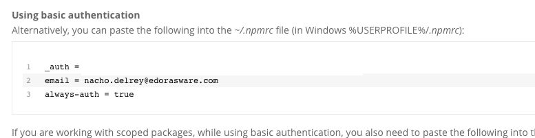

---
marp:true
title: Flowable Work Indexing
---

<!-- theme: default -->
<style>

section {
  background: #fff url(img/background.png) no-repeat center center;
  background-size: cover;
  font-family: "Montserrat";
}

section.frontpage {
  background: #fff url(img/sectionBackground.png) no-repeat center center;
  background-size: cover;
  font-family: "Montserrat";
  font-size: 50px;
  color: white;
}

section.centeredSection {
  text-align: center;
}

section.smallerFont {
  font-size: 24px;
}

@font-face {
  font-family: 'Montserrat';
  font-style: normal;
  font-weight: 200;
  src: local('Montserrat ExtraLight'), local('Montserrat-ExtraLight'),
       url('./fonts/montserrat-v12-latin-200.woff2') format('woff2'), /* Chrome 26+, Opera 23+, Firefox 39+ */
       url('./fonts/montserrat-v12-latin-200.woff') format('woff'); /* Chrome 6+, Firefox 3.6+, IE 9+, Safari 5.1+ */
}
/* montserrat-300 - latin */
@font-face {
  font-family: 'Montserrat';
  font-style: normal;
  font-weight: 300;
  src: local('Montserrat Light'), local('Montserrat-Light'),
       url('./fonts/montserrat-v12-latin-300.woff2') format('woff2'), /* Chrome 26+, Opera 23+, Firefox 39+ */
       url('./fonts/montserrat-v12-latin-300.woff') format('woff'); /* Chrome 6+, Firefox 3.6+, IE 9+, Safari 5.1+ */
}
/* montserrat-regular - latin */
@font-face {
  font-family: 'Montserrat';
  font-style: normal;
  font-weight: 400;
  src: local('Montserrat Regular'), local('Montserrat-Regular'),
       url('./fonts/montserrat-v12-latin-regular.woff2') format('woff2'), /* Chrome 26+, Opera 23+, Firefox 39+ */
       url('./fonts/montserrat-v12-latin-regular.woff') format('woff'); /* Chrome 6+, Firefox 3.6+, IE 9+, Safari 5.1+ */
}
/* montserrat-500 - latin */
@font-face {
  font-family: 'Montserrat';
  font-style: normal;
  font-weight: 500;
  src: local('Montserrat Medium'), local('Montserrat-Medium'),
       url('./fonts/montserrat-v12-latin-500.woff2') format('woff2'), /* Chrome 26+, Opera 23+, Firefox 39+ */
       url('./fonts/montserrat-v12-latin-500.woff') format('woff'); /* Chrome 6+, Firefox 3.6+, IE 9+, Safari 5.1+ */
}
/* montserrat-700 - latin */
@font-face {
  font-family: 'Montserrat';
  font-style: normal;
  font-weight: 700;
  src: local('Montserrat Bold'), local('Montserrat-Bold'),
       url('./fonts/montserrat-v12-latin-700.woff2') format('woff2'), /* Chrome 26+, Opera 23+, Firefox 39+ */
       url('./fonts/montserrat-v12-latin-700.woff') format('woff'); /* Chrome 6+, Firefox 3.6+, IE 9+, Safari 5.1+ */
}
</style>

# <!-- fit --> Creating a React application with Flowable Forms

---

## Flowable Forms introduction

- Flowable forms is Flowable's declarative forms library written in React.
- Everything you need to know is available in https://forms.flowable.io
- The online documentation lets you play with the library's components on-line with [Storybook](https://github.com/storybookjs/storybook).
- The library can be downloaded from the Flowable NPM repository
- The library is used by Flowable products like Flowable Work and Engage, in Flowable's customer solutions (projects) and also by other companies for their own projects.
- The Product team is constantly maintaining and enhancing the library.
  **Specially, following the customer's feedback**.

---

## <!-- fit --> We are building form engines for 10 years

---


---


Yes, it hurts.

Don't do it at home.

Just... don't do it.

---

## Version history

|  alias  | Technology | Timing | Status |
| --- | --- | --- | --- |
| jsf engine | JSF | ~2009 | Deprecated
| form engine | Angular 1.3 | 2010 - 2016 | Deprecated |
| view engine | Angular 1.5 | 2015 - now | Maintained |
| Flowable Forms   |  React 16.6 | 2018 - now | Active |

---

## Installation (1/2)

Configure ~/.npmrc

```bash
npm set registry https://repo.edorasware.com/api/npm/edoras-npm-repo
npm login
```

Go to https://repo.edorasware.com/ and complete a Set Me Up process. 
Choose Tool: NPM, Repository: libs-release-local-npm, and Insert your credentials


---

## Installation (2/2)

Copy the 3 lines from Basic Authentication section into your .npmrc file 



Check the configuration with npm info

```bash
npm info @flowable/forms
```

Finally, you can add the Flowable Forms dependency to your project:

```bash
yarn add @flowable/forms
```

---

## Usage with React

```javascript
import {Form} from "@flowable/forms";
class App extends React.Component{
  constructor(props) {
    super(props);
    this.onChange = this.onChange.bind(this);
    this.onOutcomePressed=this.onOutcomePressed.bind(this);
  }
  onOutcomePressed(payload, outcome) {
    console.log("OUTCOME PRESSED", payload, outcome);
  }
  onChange(payload) {
    console.log("VALUE CHANGED", payload);
  }
  render() {
    return (
      <Form
        config={frmDef}
        onChange={this.onChange}
        onOutcomePressed={this.onOutcomePressed}
      />
    );
  }
}
```

---

## Usage without npm  or react

- Flowable Forms provides an index-complete.js file that bundles all the dependencies.
- When you load the index-complete.js file you will have available the flwforms global object. This object provides:
  - render
  - edorasAdapter
  - utilities

The  [render](https://forms.flowable.io/docs/start-vanilla.html#render) function renders a form in the dom element. In the props attribute you need to pass the config (form definition) and you can optionally pass any other prop in the Form props. It returns a Form so you can call any of the Form methods from there. 

---

## Expressions

[Expressions](https://forms.flowable.io/docs/basic-expressions.html) are "calculations" that flowable forms can do for you. You can use expressions in most of the attributes used in form components. This allows you to bind components together and define form behavior. Expressions are wrapped in double curly braces {{}} and the engine will try to "calculate" them.

Examples:

```javascript
{{$currentUser.id}}
{{!disabled}}
{{age > 5}}
{{length == 5}}
{{disabled || invisible}}
{{age < 16 ? 'child' : 'adult'}}
{{names.join(", ")}}
{{colors.indexOf['red']}}
```

---

## Outcomes

- [Outcomes](https://forms.flowable.io/docs/basic-outcomes.html) are the main form actions. E.g.:


- If the outcomes are not set, the default outcome is called "COMPLETE".
- The form outcomes can be rendered outside of the form with the outcomesElement property that is passed to the <Form>.
- You can disable or hide some outcomes when some conditions are met. For example `enabled: {{$formValid}}`.

---

## Other advanced topics

- Datasource
- Utilities library
- Events
- API
- DevTools
- Saving the payload
- Styles
- Custom Components
- Custom fetch function
- Localisation
- Additional data

---
## Practical exercise

- Spring Boot based Flowable Work application with a simple workflow to create tasks
- React app that renders the list of pending tasks and the corresponding form

---
<!--
_class: centeredSection
-->
## Wrap-up, Q & A